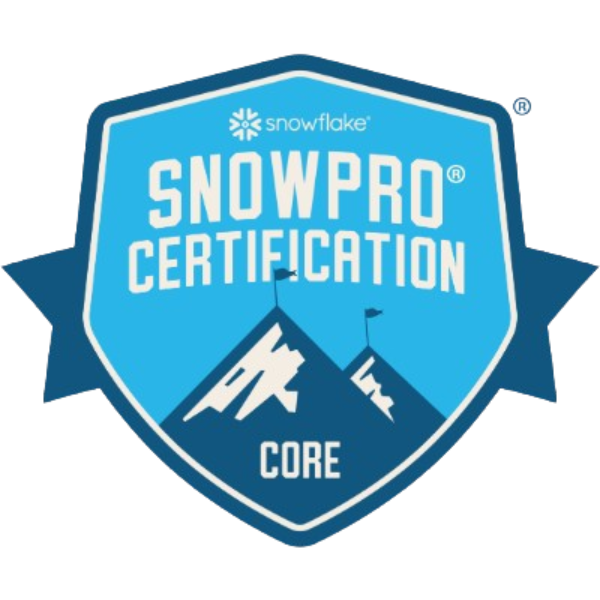

## Bio 👋

Hy there! Welcome to my Github page. Feel free to look around and raise an issue on any of my repos if you spot something.

If you want to learn more, visit my website: https://adriensourdilletil.github.io/AdrienSourdille-Portfolio/ 

Alternatively, check out my company's web page: https://www.thedataschool.co.uk/blog/adrien-sourdille/

# Certifications

| Tableau Data Analyst | Alteryx Designer Advanced | Snowpro Core |
|:-:|:-:|:-:|
|  |  |  |

## Tableau Projects (Click the Image to go to Tableau Public)
---
**Explore the solar production trends of this solar plant**
 

---
**Explore the forecasting accuracy of Renewables in France**
 

---
**Explore the composition of the UK government.**
 

---
---
**Explore France's 2022 energy mix.**
 

---
### About me
My name is Adrien, I am a binational French-Canadian analytics engineer with a unique blend of technical expertise that allow me to own each part of a data project from data ingestion to data visualisation. 

I'm passionate about leveraging data insights to drive the energy transition and support sustainable development through data-driven decisions. I have a proven track record in designing ETL pipelines, automating workflows, and delivering actionable analytics to solve complex business challenges. 

After obtaining a Master’s in Geographic Data Science from the London School of Economics, I joined the Information Lab UK in 2022. After an intensive 4 month training course, I applied my Tableau and Alteryx expertise on high-impact projects during a 12-month placement at BAE Systems, a leading defense and aeronautics company. I then bridged the gap between data analysis and data engineering during a 7-month placement at Prêt A Manger, where I used Snowflake to design and maintain efficient ETL pipelines, optimize the data warehouse, and improve reporting accuracy and speed for stakeholders.

In my free time, I love to travel, train Jiu Jitsu, and play football. I'm eager to keep developing my skills and I am confident in my ability to turn data into actionable insights.

Feel free to reach out to discuss data, analytics, potential projects or Data Engineering Employment Opportunities.

