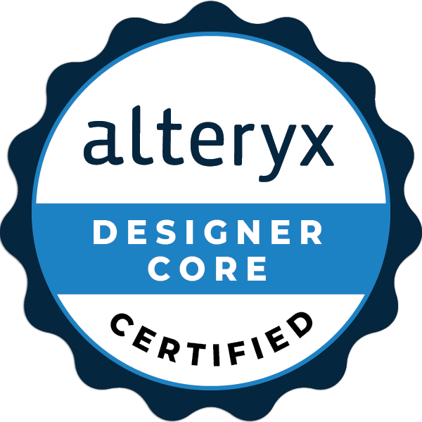

## Bio 👋

As a binational French and Canadian data consultant, I combine technical expertise and business intelligence. I have a Master's degree in Geographic Data Science and a Bachelors degree in management from the London School of Economics. I am passionate about the energy sector and am dedicated to using data insights to drive the energy transition. Currently, I am honing my skills at The Information Lab, where I am undergoing training on Tableau and Alteryx. I am perfecting my skills in data analysis, data visualization, and project management, and have a proven track record of utilizing data and analytics to solve complex business challenges and drive meaningful business outcomes.

# Certifications

| Tableau Data Analyst Certification | Alteryx Designer Advanced Certified | Alteryx Server Designer Core |
|:-:|:-:|:-:|:-:|
|  |  |  |
